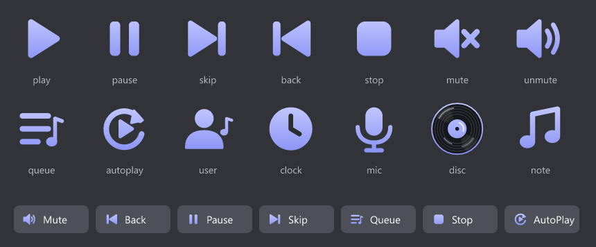

# 🎵 Discord Music Bot

บอทเปิดเพลงใน Discord ด้วย Slash Command — ค้นหาเพลงจากชื่อหรือลิงก์ YouTube แล้วเล่นในห้องเสียง พร้อม Music Panel แบบมีปุ่มกด



## ✨ ความสามารถ

- `/play` เล่นเพลงจาก**ชื่อเพลง**หรือ**ลิงก์ YouTube** — บอทจะเข้าห้องเสียงเดียวกับคุณเอง
- **คิวเพลง** เล่นเพลงถัดไปอัตโนมัติ (สูงสุด 100 เพลง)
- **Music Panel** มีปุ่ม Mute / Back / Pause / Skip / Queue / Stop / AutoPlay
- **Autoplay** คิวหมดแล้วหาเพลงที่เกี่ยวข้องมาเล่นต่อจาก YouTube Mix (ข้ามไลฟ์, คลิปยาวเกิน 10 นาที และเพลงที่เพิ่งเล่น)
- เพลงที่จบแล้วย่อเป็นการ์ดเล็ก แชทไม่รก
- ออกจากห้องเองเมื่อไม่มีเพลง 3 นาที หรือไม่มีคนในห้อง 1 นาที
- อัปเดต yt-dlp อัตโนมัติทุกครั้งที่เปิดบอท

## 📋 คำสั่ง

| คำสั่ง | ทำอะไร |
|---|---|
| `/play query:<ชื่อเพลงหรือลิงก์>` | เล่นเพลง / เพิ่มเข้าคิว |
| `/queue` | ดูคิวเพลง |
| `/nowplaying` | ดูเพลงที่กำลังเล่น + แถบเวลา |
| `/pause` `/resume` | หยุดชั่วคราว / เล่นต่อ |
| `/skip` | ข้ามเพลง |
| `/stop` | หยุดและล้างคิว |
| `/volume level:<0-150>` | ปรับเสียง (ไม่ใส่ค่า = ดูระดับปัจจุบัน) |
| `/autoplay` | เปิด/ปิด Autoplay |
| `/join` `/leave` | ให้บอทเข้า / ออกจากห้องเสียง |
| `/ping` | เช็กว่าบอทยังทำงานอยู่ |

> คำสั่งควบคุม (skip, stop, pause, volume ฯลฯ) ใช้ได้เฉพาะคนที่อยู่ห้องเสียงเดียวกับบอท

---

## 🛠️ วิธีติดตั้ง (ทำตามทีละขั้น)

### ขั้นที่ 1: ติดตั้งโปรแกรมที่ต้องใช้

| โปรแกรม | เวอร์ชัน | ดาวน์โหลด |
|---|---|---|
| **Node.js** | 24.17 ขึ้นไป | https://nodejs.org |
| **FFmpeg** | เวอร์ชันไหนก็ได้ที่รองรับ Opus | Windows: `winget install --id Gyan.FFmpeg -e` / Mac: `brew install ffmpeg` / Linux: `sudo apt install ffmpeg` |
| **Git** | — | https://git-scm.com |

ติดตั้งเสร็จแล้ว **ปิดแล้วเปิด Terminal (หรือ VS Code) ใหม่** จากนั้นเช็กว่าใช้ได้:

```bash
node -v
ffmpeg -version
```

### ขั้นที่ 2: สร้างบอทใน Discord Developer Portal

1. ไปที่ https://discord.com/developers/applications → **New Application** → ตั้งชื่อ → **Create**
2. หน้า **General Information** → คัดลอก **Application ID** (= `CLIENT_ID`)
3. หน้า **Bot** → **Reset Token** → คัดลอก **Token** เก็บไว้ (= `DISCORD_TOKEN`)
   - ⚠️ Token คือรหัสผ่านของบอท **ห้ามส่งให้ใคร ห้ามโพสต์ ห้าม commit ขึ้น GitHub**
   - Privileged Gateway Intents ทั้ง 3 ตัว **ไม่ต้องเปิด**
4. เชิญบอทเข้า Server — เปิดลิงก์นี้ (แทน `ใส่_APPLICATION_ID` ด้วยค่าจากข้อ 2):
   ```
   https://discord.com/oauth2/authorize?client_id=ใส่_APPLICATION_ID&permissions=3165184&scope=bot+applications.commands
   ```
   (สิทธิ์: View Channels, Send Messages, Embed Links, Connect, Speak — ไม่มี Administrator)
5. ใน Discord: **User Settings → Advanced → เปิด Developer Mode** → คลิกขวาที่ไอคอน Server → **Copy Server ID** (= `GUILD_ID`)

### ขั้นที่ 3: ดาวน์โหลดโค้ด

กด **Fork** มุมขวาบนของหน้านี้ แล้ว clone repo ที่ fork มา (หรือ clone repo นี้ตรง ๆ ก็ได้):

```bash
git clone https://github.com/<ชื่อบัญชีของคุณ>/discord-music-bot.git
cd discord-music-bot
npm install
```

### ขั้นที่ 4: ดาวน์โหลด yt-dlp

บอทใช้ [yt-dlp](https://github.com/yt-dlp/yt-dlp) ดึงเสียงจาก YouTube — สร้างโฟลเดอร์ `bin` แล้วโหลดไฟล์ตามระบบของคุณจาก [หน้า Releases](https://github.com/yt-dlp/yt-dlp/releases/latest):

| ระบบ | ไฟล์ที่โหลด | บันทึกเป็น |
|---|---|---|
| Windows | `yt-dlp.exe` | `bin/yt-dlp.exe` |
| Mac | `yt-dlp_macos` | `bin/yt-dlp` (แล้วรัน `chmod +x bin/yt-dlp`) |
| Linux | `yt-dlp_linux` | `bin/yt-dlp` (แล้วรัน `chmod +x bin/yt-dlp`) |

> ไม่ต้องติดตั้ง Python หรือ Deno — ไฟล์ทางการของ yt-dlp รวมทุกอย่างมาแล้ว และบอทใช้ Node.js เป็น JavaScript runtime ให้ yt-dlp

### ขั้นที่ 5: ใส่ค่าใน `.env`

คัดลอกไฟล์ `.env.example` เป็น `.env` แล้วใส่ค่าจากขั้นที่ 2:

```env
DISCORD_TOKEN=Token_ของบอท
CLIENT_ID=Application_ID
GUILD_ID=Server_ID
```

> ไฟล์ `.env` อยู่ใน `.gitignore` แล้ว จะไม่ถูก commit ขึ้น GitHub

### ขั้นที่ 6: ลงทะเบียนคำสั่ง แล้วเปิดบอท

```bash
npm run deploy   # ลงทะเบียน Slash Commands กับ Server (ทำครั้งแรก และทุกครั้งที่เพิ่ม/แก้คำสั่ง)
npm start        # เปิดบอท
```

ถ้าขึ้น `Online แล้วในชื่อ ...` แปลว่าสำเร็จ 🎉 เข้าห้องเสียงแล้วลอง `/play` ได้เลย

### ขั้นที่ 7 (ไม่บังคับ): ไอคอนธีมม่วง

ไอคอนบนปุ่มเป็น Emoji ของบอทแต่ละตัว — ต้องอัปโหลดให้บอทของคุณเองหนึ่งครั้ง:

```bash
npm run icons -- --upload
```

แล้วเปิดบอทใหม่ ถ้าข้ามขั้นนี้ บอทยังใช้งานได้ปกติ แต่จะใช้ Emoji มาตรฐานแทน

---

## 🔁 ให้บอทออนไลน์ตลอด (ไม่บังคับ)

ใช้ [pm2](https://pm2.keymetrics.io) รันบอทเบื้องหลังและเปิดใหม่เองเมื่อล่ม:

```bash
npm install -g pm2
pm2 start ecosystem.config.js
pm2 save
```

| ต้องการ | คำสั่ง |
|---|---|
| ดูสถานะ | `pm2 list` |
| ดู log | `pm2 logs music-bot` |
| แก้โค้ดแล้วให้มีผล | `pm2 restart music-bot` |

- **Linux/Mac:** รัน `pm2 startup` แล้วทำตามที่มันบอก เพื่อให้เปิดเองตอนบูตเครื่อง
- **Windows:** `pm2 startup` ใช้ไม่ได้ — ใช้ Task Scheduler สั่ง `pm2 resurrect` ตอนล็อกอินแทน
- ⚠️ เมื่อใช้ pm2 แล้ว **ห้ามรัน `npm start` ซ้ำ** ไม่งั้นจะมีบอท 2 ตัวตอบคำสั่งซ้ำกัน

> 💡 **รันบนเครื่องที่บ้านดีที่สุด** — YouTube มักบล็อก IP ของ VPS/คลาวด์ (yt-dlp จะขึ้น *"Sign in to confirm you're not a bot"*)

---

## ❓ แก้ปัญหาที่พบบ่อย

| อาการ | สาเหตุ / วิธีแก้ |
|---|---|
| `ไม่พบ DISCORD_TOKEN ในไฟล์ .env` | ยังไม่ได้สร้าง `.env` หรือยังไม่ได้กด Save |
| `ไม่พบ FFmpeg ใน PATH` | ติดตั้ง FFmpeg แล้ว**ปิด/เปิด Terminal และ VS Code ใหม่ทั้งหมด** |
| `เรียก yt-dlp ไม่ได้` | ยังไม่ได้ดาวน์โหลด yt-dlp ไว้ที่ `bin/` (ขั้นที่ 4) |
| พิมพ์ `/` แล้วไม่เห็นคำสั่งของบอท | ยังไม่ได้ `npm run deploy` หรือ `GUILD_ID` ผิด Server → กด `Ctrl + R` ใน Discord |
| `ไม่พบคำสั่ง /xxx` ใน Terminal | เพิ่มคำสั่งใหม่แล้วยังไม่ได้ restart บอท |
| `HTTP Error 403: Forbidden` นาน ๆ ครั้ง | YouTube ปฏิเสธชั่วคราว — บอทลองใหม่ให้อัตโนมัติ |
| เพลงเล่นไม่ได้บ่อย ๆ | yt-dlp อาจเก่า — บอทอัปเดตเองตอนเปิด ลอง restart บอท |

---

## 🧱 สร้างด้วย

[discord.js](https://discord.js.org) · [@discordjs/voice](https://github.com/discordjs/discord.js/tree/main/packages/voice) · [yt-dlp](https://github.com/yt-dlp/yt-dlp) · [FFmpeg](https://ffmpeg.org) · [opusscript](https://github.com/abalabahaha/opusscript)
